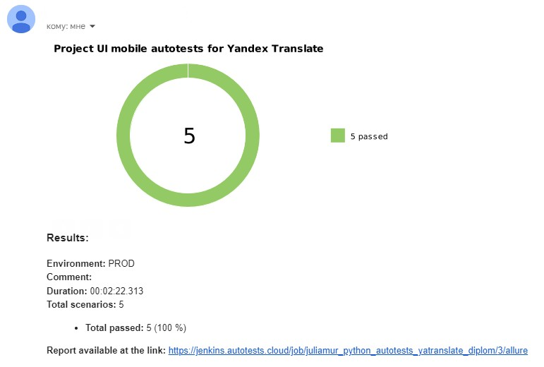

# Пример организации мобильного автотестирования для приложения Яндекс Переводчик
> Яндекс Переводчик — это сервис автоматического перевода слов и выражений, текстов с фотографий и картинок, 
> сайтов и мобильных приложений.

## :open_book: Содержание:
- [Описание проекта](#heavy_check_mark-описание)
- [Кратко](#heavy_check_mark-кратко)
- [Технологии и инструменты](#gear-технологии-и-инструменты)
- [Что проверяем](#heavy_check_mark-реализованные-ui-проверки)
- Запуск тестов:
  - [Jenkins](#-запуск-тестов-из-jenkins)
  - [Локально](#computer-локальный-запуск)
- Отчеты:
  - [Allure](#bar_chart-отчеты-о-прохождении-тестов-доступны-в-allure)
  - [BrowserStack](#)
  - [Telegram](#-telegram)
  - [Email](#email-email)
- [Allure TestOps](#briefcase-проект-интегрирован-с-allure-testops)
- [Видео прогона теста](#movie_camera-пример-видео-тестового-прогона)


## :heavy_check_mark: Описание
В проекте представлен пример автоматизации UI-тестирования мобильного приложения с использованием Python + Pytest + Selene + Appium + Allure.
<p>При написании тестов применялись инструменты объектно-ориентированной парадигмы, а также использовался шаблон 
проектирования PageObjects.
<p>Реализован локальный запуск тестов через Android Studio, а также удаленный в BrowserStack.</p>
<p>Подключена система отчетности Allure Reports с вложениями (логи, скриншоты, видео, etc). Реализовано автоматическое
подтягивание allure.title из названия функций и их параметров, используя декораторы @step.

<p>По факту прохождения теста отправляется уведомление с результатами в Telegram и на электронную почту.
<p>Реализован запуск тестов как с использованием Android Studio, так и Browserstack.
<p>Осуществлена интеграция с Allure TestOps.

## :heavy_check_mark: Кратко
- [x] `Page Object` с шагами `Fluent of Invocations`
- [x] `Application Manager`
- [x] Self-documenting code
- [x] Кастомный локальный запуск с использованием `Android Studio` или `Browserstack`
- [x] Удаленный запуск с использованием `Jenkins` и `Browserstack`
- [x] `Allure Reports` с вложениями (логи, скриншоты, видео)
- [x] Интеграция с `Allure TestOps`
- [x] Отправка результатов тестирования по `email` и в `Telegram`

## :gear: Технологии и инструменты:

<div align="center">
  &nbsp;
  &nbsp; 
  &nbsp;  
  &nbsp;
  &nbsp;  
  &nbsp;    
  &nbsp;
  &nbsp;
  &nbsp;
  &nbsp;
  &nbsp;
  &nbsp;
</div>

## :heavy_check_mark: Реализованные UI-проверки

> - перевод текста с английского на русский;
> - переключение языков перевода по кнопке;
> - кнопка Translate site видна при вводе адреса сайта;
> - очистка заполненного поля ввода по клику на иконку крестика;
> - открытие текста перевода в полноэкранном поп-апе.

##  Запуск тестов из [Jenkins](https://jenkins.autotests.cloud/job/juliamur_python_autotests_yatranslate_diplom/)

Для запуска тестов из Jenkins:
1. Нажмите кнопку "Собрать сейчас".
<p></p>

## :computer: Локальный запуск 

Для локального запуска:
1. Склонируйте репозиторий
2. Установите Poetry `poetry install`
3. Откройте проект в PyCharm, установите интерпретатор
4. Запустите BrowserStack
   - Получите ваш username, access key и загрузите apk из папки resources для получения app id
6. Установите Android Studio и Appium
   - Запустите Appim Server
   - Запустите в Android Studio эмуляцию устройства
   - Введите в командной строке `adb devices` для проверки, что устройство доступно
7. Создайте `env` файлы по образцам в папке проекта:
    - `config.browserstack.env` с вашими данными
    - `config.local.env`
9. Запустите тесты в PyCharm или в командной строке: 
```bash
pytest . --alluredir allure-results/
```
10. Проверьте статус запуска в BrowserStack

### :heavy_plus_sign: Параметры сборки

> В файле `config.py` измените значение `EnvContext`:
> - `local` — локальный запуск в запущенном устройстве Android Studio
> - `browserstack` — запуск тестов в BrowserStack

## :bar_chart: Отчеты о прохождении тестов доступны в Allure

###  Allure

> При локальном запуске введите в командной строке:
```bash
allure serve .\allure-results
```

#### Примеры отображения тестов

<p></p>

<p></p>

###  BrowserStack


###  Telegram

Настроена отправка отчета в Telegram


### Email

Настроена отправка отчета на электронную почту



## :briefcase: Проект интегрирован с Allure TestOps 

#### Автоматически собраны тест-кейсы


## :movie_camera: Пример видео тестового прогона

В отчетах Allure для каждого UI-теста прикреплен не только скриншот, но и видео прохождения теста

<p align="center">
  
</p>

